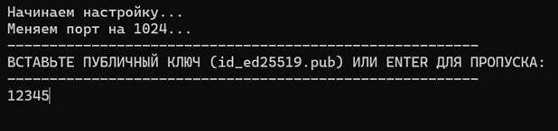

# Запуск

1. Зайти на сервер по ssh от имени **root**
2. Ввести команду
3. Все выполнится автоматически **(Добавить ключ нужно вручную)**

```bash

wget -qO- "https://raw.githubusercontent.com/shinikakeru/Auto-Set-VPS/main/vps.sh?cache=$(date +%s)" > setup.sh \&\& chmod +x setup.sh \&\& sudo ./setup.sh ; rm -f setup.sh

```

<p align="center">
  
</p>

<p align="center">
  
</p>

<p align="center">
  
</p>


## Что делает скрипт

1. Меняет порт на 1024 для ssh в **/etc/ssh/sshd\_config**
2. Добавляет SSH ключ в **/root/.ssh/authorized\_keys** **(опционально)**
3. Скрывает баннеры **PrintMotd** и **PrintLastLog**, которые идут по умолчанию в **/etc/ssh/sshd_config**
4. Создает свой баннер
5. Вывод текущие ключи на сервере в **/root/.ssh/authorized_keys**
6. Автоматически настраивает фаервол, оставляет открытым **только порт для ssh**
7. Перезапускает службы
8. Чистит файлы за собой
