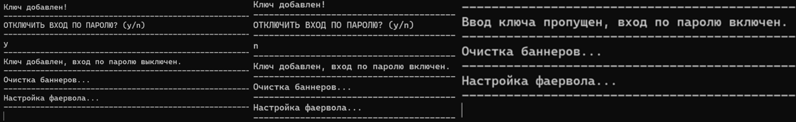
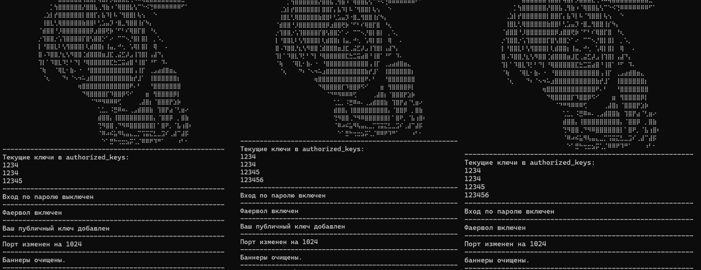

# Запуск

1. Зайти на сервер по ssh от имени **root**
2. Ввести команду
```bash
wget -qO- "https://raw.githubusercontent.com/shinikakeru/Auto-Set-VPS/main/vps.sh?cache=$(date +%s)" > setup.sh && chmod +x setup.sh && sudo ./setup.sh
```
3. Все выполнится автоматически **(Добавить ПУБЛИЧНЫЙ ключ нужно вручную)**

## Изображения работы
<p align="center">
  
</p>

<p align="center">
  
</p>

<p align="center">
  
</p>


## Что делает скрипт

1. Меняет порт на 1024 для ssh в **/etc/ssh/sshd\_config**
2. Добавляет SSH ключ в **/root/.ssh/authorized\_keys** **(опционально)**
3. Отключает/Включает вход по паролю **(опционально только для подключения по SSH ключу)**
3. Скрывает баннеры **PrintMotd** и **PrintLastLog**, которые идут по умолчанию в **/etc/ssh/sshd_config**
4. Создает свой баннер
5. Автоматически настраивает фаервол, оставляет открытым **только порт для ssh**
6. Выводит текущие ключи на сервере в **/root/.ssh/authorized_keys**
7. Перезапускает службы
8. Чистит файлы за собой

## Полезные команды
**Для powershell**

1. Создаст ключ формата ed25519 с вашим названием по пути `C:\Users\Имя_Пользователя\.ssh\`
```powershell
ssh-keygen -t ed25519 -f $HOME\.ssh\имя_вашего_ключа
```
2. Сразу открыть публичный ключ
```powershell
cat $HOME\.ssh\имя_вашего_ключа.pub
```
3. Если вы создаете ключ впервые, папки .ssh может еще не существовать. В таком случае команда ssh-keygen может выдать ошибку. Если это произойдет, сначала создайте папку командой:
```powershell
mkdir $HOME\.ssh
```
