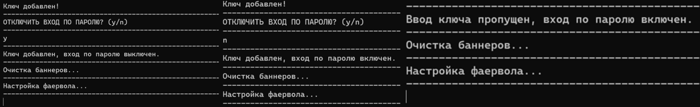
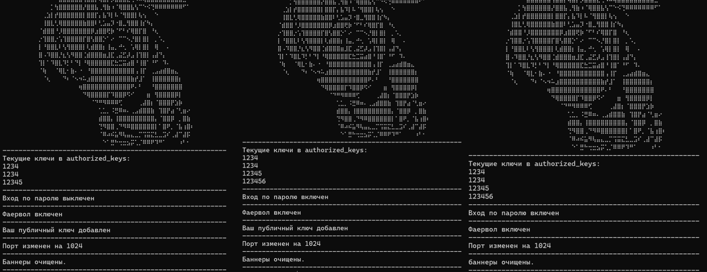

# Запуск

1. Зайти на сервер по ssh от имени **root**
2. Ввести команду
```bash
curl -sL "https://raw.githubusercontent.com/shinikakeru/Auto-Set-VPS/main/vps.sh?cache=$(date +%s)" > setup.sh && chmod +x setup.sh && sudo ./setup.sh
```
3. Все выполнится автоматически **(Добавить ПУБЛИЧНЫЙ ключ нужно вручную)**

## Изображения работы
<p align="center">
  
</p>

<p align="center">
  
</p>

<p align="center">
  
</p>


## Что делает скрипт

<table>
  <tr><td align="center">1.</td><td>Меняет порт на 1024 для ssh в <b>/etc/ssh/sshd_config</b></td></tr>
  <tr><td align="center">2.</td><td>Добавляет SSH ключ в <b>/root/.ssh/authorized_keys</b> <b>(опционально)</b></td></tr>
  <tr><td align="center">3.</td><td>Отключает/Включает вход по паролю <b>(опционально только для подключения по SSH ключу)</b></td></tr>
  <tr><td align="center">4.</td><td>Скрывает баннеры <b>PrintMotd</b> и <b>PrintLastLog</b>, которые идут по умолчанию в <b>/etc/ssh/sshd_config</b></td></tr>
  <tr><td align="center">5.</td><td>Создает свой баннер</td></tr>
  <tr><td align="center">6.</td><td>Автоматически настраивает фаервол, оставляет открытым <b>только порт для ssh</b></td></tr>
  <tr><td align="center">7.</td><td>Скачивает и настраивает fail2ban для <b>1024 порта</b></td></tr>
  <tr><td align="center">8.</td><td>Выводит текущие ключи на сервере в <b>/root/.ssh/authorized_keys</b></td></tr>
  <tr><td align="center">9.</td><td>Перезапускает службы</td></tr>
  <tr><td align="center">10.</td><td>Чистит файлы за собой</td></tr>
</table>

## Полезные команды
**Для powershell**

1. Создаст ключ формата ed25519 с вашим названием по пути `C:\Users\Имя_Пользователя\.ssh\`
```powershell
ssh-keygen -t ed25519 -f $HOME\.ssh\имя_вашего_ключа
```
2. Сразу открыть публичный ключ
```powershell
cat $HOME\.ssh\имя_вашего_ключа.pub
```
3. Если вы создаете ключ впервые, папки .ssh может еще не существовать. В таком случае команда ssh-keygen может выдать ошибку. Если это произойдет, сначала создайте папку командой:
```powershell
mkdir $HOME\.ssh
```
